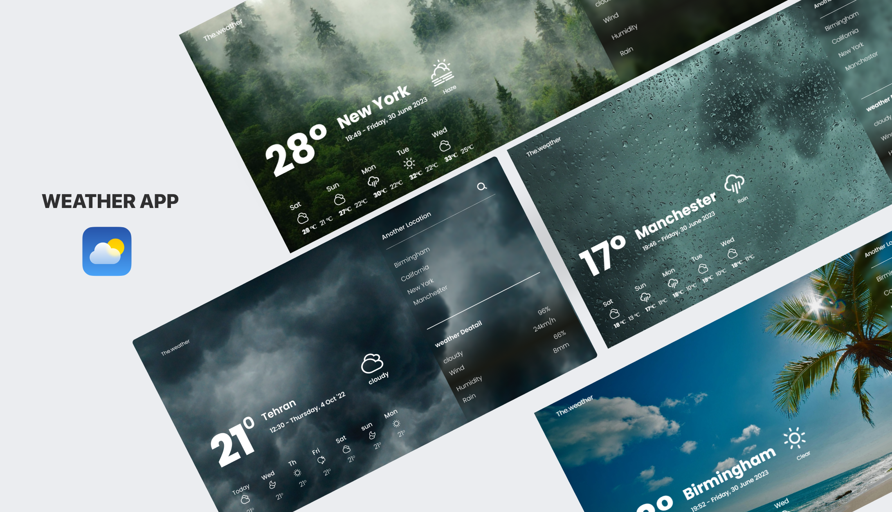

# Weather app 

A simple weather application that provides current weather information for a given location.




## Features

- Get current weather conditions, including temperature, humidity, and wind speed.
- Search for weather by city name.
- Automatically detects the user's location for quick weather updates.
- Supports both metric and imperial units for temperature and wind speed.

## Installation

1. Clone the repository: 

```sh
 git clone https://github.com/your-username/weather-app.git
 ```

2. Install NPM packages
  ```sh
 npm install
  ```

  1. Run the project:
  ```
  npm run dev
  ```


## Links

- Live Site URL: [live site](https://tip-calculator-app-sigma-hazel.vercel.app/)
  
## Built 
- Semantic HTML5 markup
- CSS custom properties
- Flexbox
- CSS Grid
- Desktop-first workflow
- Javascript
- parcel NPM packge mangager


## Roadmap

- [x] Add different backgrounds based on the weather conditions.
- [x] Add weather icons corresponding to the current weather conditions.
- [x] Display the maximum and minimum temperature for the next 5 days.
- [x] Provide weather information for 4 different cities.
- [x] Include humidity, wind, rainfall, and cloudiness data for the current city.


## Author
- Twitter - [@itsnooshindev](https://www.twitter.com/itsnooshindev)


